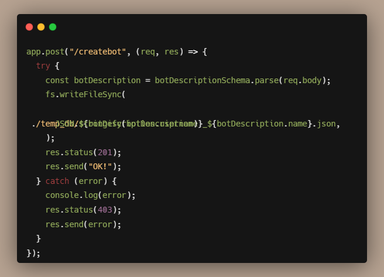

----

# Table contnets 
* [Deployment](#deployment)
* [Set up](#set-up)
* [User demo](#user-demo)
* [Features](#features)
* [CODE SNIPPETS](#code-snippets)
* [Tech status](#tech-status)
* [API Reference](#api-reference)
* [Contribution](#contribution)
* [License](#license)


## Deployment

To deploy this project run

```bash
  npm run dev
```

## Set up
- These are the steps required to install the project.
1. Clone the repo
   ```sh
   git clone [https://github.com/YOUR_USERNAME/Project-Name.git](https://github.com/dm-coding2004/hack-a-league-2.0)
   ```
2. Install NPM packages
   ```sh
   npm install npm@latest -g
   ```

## User demo
    
## Features
* Get a script tag of custom AI bot created by the clients for their online products.
* And get a custom page for offline products. 

## CODE SNIPPETS


## Tech status
|Language|        Use Case                         |
|:-------|:-------------------------------:|
||  Data feeding to LLM model|
|lang chain | LLM framework|
|ollama |    Running LLM locally|
|tinyllama|  Fork of llama 2|
||   authentication and database|
|| backend server|
|express js| backend server|
||  framework for dynamic pages|
||   ui library |
||  type validation for js|
|Zod |  typescript schema runtime validation|
||  shorthand css|
|swiper js|  block animation|
|react scroll-animation|  scroll animation|
|locomotive-scroll|   smooth scroll|
----

## API Reference

#### Get all items

```bash
  GET /chatbot/:ownername/:botname/chat?input="Your Input"
```

Outpt: The Generated Text bye the LLM Model with custom dataset provider by that owner.

#### Post item

```bash
  POST /createbot {body: {
username,
name,
dp,
companyname,
category,
questions: [{question,answer}]
}}
```

Create a custom bot and gives a script tag and a custom page link.


## Contribution

Contributions are always welcome!

See `contributing.md` for ways to get started.

Please adhere to this project's `code of conduct`.


## License

[MIT](https://choosealicense.com/licenses/mit/)

[](https://opensource.org/licenses/MIT)


