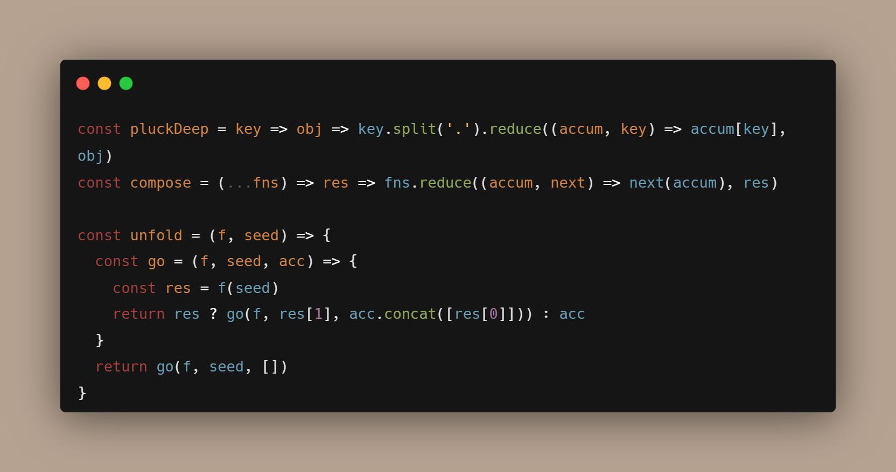

-----


# Table contnets 
* [CODE SNIPPETS](#code-snippets)
* [Instructions](#instructions)
* [creating a tech status table](#creating-a-tech-status-table)
* [Setup](#setup)
---

## Deployment

To deploy this project run

```bash
  npm run deploy
```


## Installation

Install my-project with npm

```bash
  npm install my-project
  cd my-project
```
    
## Features

- Light/dark mode toggle
- Live previews
- Fullscreen mode
- Cross platform

## CODE SNIPPETS


----

## Instructions
+ go to files
+ click on new
   + create anew one
   + commit changes
-----

## creating a tech status table
|Languge| client | features |
|:------|:------:|---------:| 
|pytho  |sgdh    |uewrgewa  |
----

## setup

## API Reference

#### Get all items

```http
  GET /api/items
```

| Parameter | Type     | Description                |
| :-------- | :------- | :------------------------- |
| `api_key` | `string` | **Required**. Your API key |

#### Get item

```http
  GET /api/items/${id}
```

| Parameter | Type     | Description                       |
| :-------- | :------- | :-------------------------------- |
| `id`      | `string` | **Required**. Id of item to fetch |

#### add(num1, num2)

Takes two numbers and returns the sum.


## Appendix

Any additional information goes here


## Contributing

Contributions are always welcome!

See `contributing.md` for ways to get started.

Please adhere to this project's `code of conduct`.


## License

[MIT](https://choosealicense.com/licenses/mit/)


